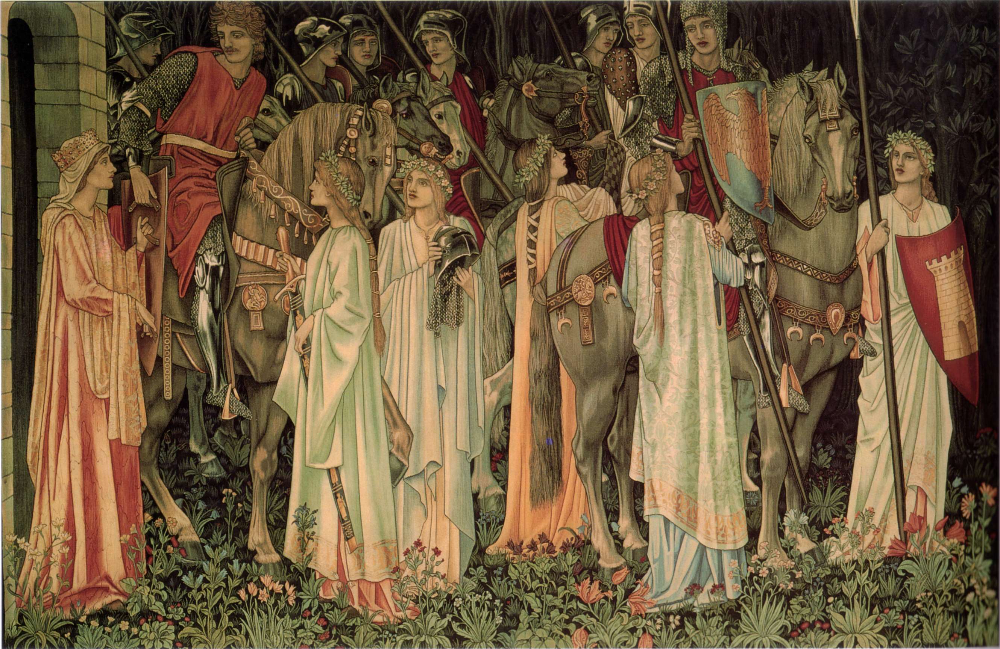

This is an ideal architecture not a real architecture with tradeoffs. This might never be achieved but it acts as a north star.

On the high level there are no clients and servers. There are only systems (computers) connected in a distributed system.

# Topology

Systems are organized in a round table tree hierarchy. I called this ring tree hierarchy before but I want to emphasize that nodes can talk between each other "across the table".  Each system is a node.

*The Arming and Departure of the Knights* from the Holy Grail tapestries, designed by Edward Burne-Jones, William Morris and John Henry Dearle, woven by Morris & Co. (1891–94). Public domain, via [Wikimedia Commons](https://commons.wikimedia.org/wiki/File:Holy_Grail_Tapestry_-The_Arming_and_Departure_of_the_Kniights.jpg).